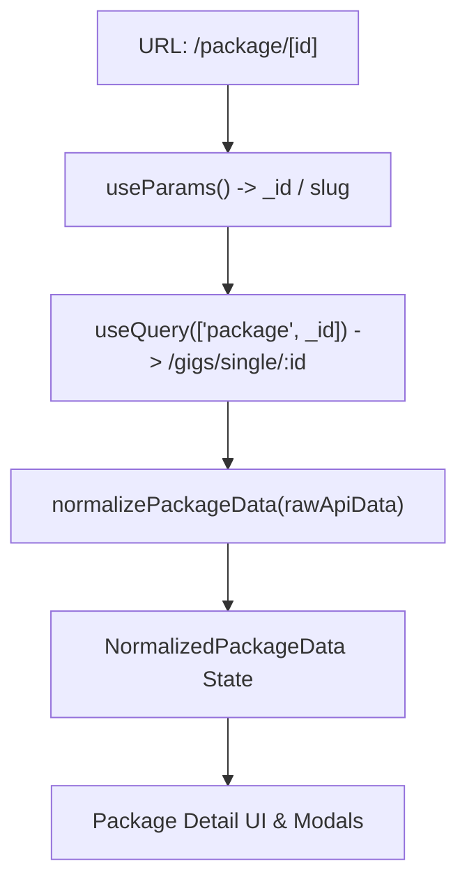

# Architectural Audit: Package Custom Design Proposal Modal

> **Target Route:** `/package/[id]` (e.g. `/package/ui-conversion-landing-page-muc85w30`)  
> **Feature:** 10-Second Custom Design Proposal Modal with per-package `sessionStorage` tracking.  
> **Status:** AUDIT ONLY (No code changes implemented).

---

## 1. Existing Package Page Architecture

### 1.1 Routing & Route Handling
* **Route Path:** `src/app/(marketing)/package/[id]/page.tsx`
* **Route Group:** Marketing route group `(marketing)` with public layout shell.
* **Dynamic Parameter:** Param `[id]` handles both MongoDB ObjectIDs (e.g. `65f123...`) and SEO-friendly slug strings (e.g. `ui-conversion-landing-page-muc85w30`).
* **Component Structure:**
  * Root export: `PackagePage()` wrapped in React `<Suspense fallback={<PackageDetailSkeleton />}>`.
  * Inner client component: `PackageContent()` with `"use client"` directive.
  * Parameters extracted via `useParams()`.

### 1.2 Data Flow & Normalization Pipeline
1. **API Fetching (`useQuery`):**
   * Endpoint: `axiosFetch.get('/gigs/single/${_id}')`.
   * Cache key: `['package', _id]`.
   * Return payload: Raw gig document (`rawApiData`) containing relational properties (`userID`, `packages`, `ratings`, `category`).
2. **Data Normalization (`normalizePackageData`):**
   * Utility: `src/features/package/utils/packageDetailsNormalizer.ts`.
   * Returns a strongly-typed `NormalizedPackageData` object containing:
     * `id`: string
     * `title`: string
     * `categoryName`: string
     * `categorySlug`: string
     * `subcategoryName`: string
     * `seller`: `SellerDetails` (`id`, `username`, `name`, `avatar`, `isOnline`, `rating`, `reviewCount`, `isPro`, etc.)
     * `packages`: `basic`, `standard`, `premium` tier deliverables.
     * `gallery`: string array of CDN URLs.

---

## 2. Existing Modal & Dialog Architecture in Workvence

### 2.1 Audit of Existing Modals in Codebase
* **Generic Modals:**
  * `src/components/ui/ConfirmModal/ConfirmModal.tsx`: Uses fixed full-screen overlay (`fixed inset-0 z-[1000]`), `backdrop-blur-xs`, `bg-slate-900/60`, centered card, and keyboard Escape handling.
* **Feature Modals:**
  * `src/features/auth/AuthModal/AuthModal.tsx`: Authentication dialog with tab switching and form submission.
  * `src/features/buyer/briefs/SubmitProposalModal/SubmitProposalModal.tsx`: Seller brief proposal modal with validation and form inputs.
  * `src/features/orders/OrderActionModals/OrderActionModals.tsx`: Review submission, revision request, and cancellation modals.

### 2.2 Reusability Evaluation
* Existing modals use hardcoded body content structures tailored for alerts or specific forms.
* **Finding:** The Custom Design Proposal Modal has a unique layout:
  * Top half visual split banner with floating round close button.
  * Centered overlapping circular avatar (`-mt-10`) with online indicator dot.
  * Centered typography, guarantee footnote, primary dark action CTA, and secondary text action link.
* **Recommendation:** Create a dedicated, modular presentation component:
  `src/features/package/components/CustomDesignOfferModal.tsx`
  following Workvence's design system tokens and standard accessibility practices.

---

## 3. Existing Navigation, CTA & Flow Options

When a buyer clicks the primary CTA on the modal ("Get tailored proposals →" or "Send message"), there are two valid destination workflows in the existing codebase:

### Option A: Brief Creation Flow (`/briefs/create`) — Recommended for "Tailored Proposals"
* **Route:** `src/app/briefs/create/page.tsx`
* **Behavior:** Allows buyers to post a custom brief ("Share your style, format, and deadline once. Compare tailored proposals").
* **Context Passing:** Can receive query parameters (`/briefs/create?category=${categorySlug}&title=Custom+Design+Inquiry`).
* **Matches Copy:** Exactly matches the copy in the supplied design screenshot (*"Compare tailored proposals from design professionals. Free to post. Your draft stays private until you publish it."*).

### Option B: Direct Seller Contact Flow (`handleContact`)
* **Function:** Existing `handleContact` in `src/app/(marketing)/package/[id]/page.tsx:131-179`.
* **Behavior:** Authenticates buyer -> calls `axiosFetch.post('/conversations')` -> routes to `/message/[conversationId]`.
* **Target:** Direct 1-on-1 discussion with the specific package seller.

---

## 4. Relevant Files & Impact Analysis

| File Path | Current Responsibility | Proposed Change | Reason |
| :--- | :--- | :--- | :--- |
| `src/app/(marketing)/package/[id]/page.tsx` | Main package detail controller & layout assembler | Integrate `usePackageModalSession` hook & mount `CustomDesignOfferModal` | Triggers the 10s timer, connects seller/package data, and conditionally mounts the modal |
| `src/features/package/components/CustomDesignOfferModal.tsx` | *(New file)* | Implement presentation modal dialog | Renders the exact UI specified in the design screenshot with accessibility & animations |
| `src/features/package/hooks/usePackageModalSession.ts` | *(New file)* | Manage 10s timer & `sessionStorage` tracking | Encapsulates storage read/write, timer lifecycle, unmount cleanup, and Strict Mode safety |
| `src/features/package/index.ts` | Package feature public exports | Export `CustomDesignOfferModal` and `usePackageModalSession` | Maintains modular architecture and clean barrel imports |
| `public/media/custom-design-banner.jpg` | *(New asset / fallback)* | Top visual banner asset | Provides the split creative/mockup banner image for the modal header |

---

## 5. Technical Constraints & Risks

### 5.1 Next.js App Router & SSR Safety
* `sessionStorage` is a client-only API. Direct access during server rendering will cause hydration mismatches or `ReferenceError: sessionStorage is not defined`.
* **Constraint:** Storage operations must only execute inside client hooks (`useEffect`) with `typeof window !== 'undefined'` guards.

### 5.2 React 19 Strict Mode & Double Invocation
* In development / Strict Mode, `useEffect` runs mount -> unmount -> mount.
* **Risk:** A naive `setTimeout` without proper cleanup will create duplicate timers or open the modal prematurely.
* **Mitigation:** The hook must store the active timer in a ref or local variable and return an explicit `clearTimeout(timer)` in the cleanup function.

### 5.3 Storage Corruption & Private Browsing Mode
* `sessionStorage` may throw security errors (e.g. `QuotaExceededError` or `SecurityError` in locked down iframe/Safari private modes) or contain corrupted non-JSON strings.
* **Mitigation:** All `sessionStorage.getItem()` and `sessionStorage.setItem()` calls must be wrapped in `try { ... } catch { ... }` blocks with in-memory fallback.

### 5.4 Timing of Timer Start: Mount vs. Data Loaded
* **Question:** Should the 10-second timer start on page mount or after package data loads?
* **Analysis:**
  * If package data is loading, rendering the modal before seller data arrives would display blank avatar/name placeholders.
  * If the network is slow (takes 3s to load), starting at mount means the modal could pop up only 7s after the user actually starts reading.
* **Recommendation:** Start the 10-second timer **once `rawApiData` / `normalizedData` is successfully loaded and valid `_id` is available**. If the package returns a 404 error, no modal should ever appear.
