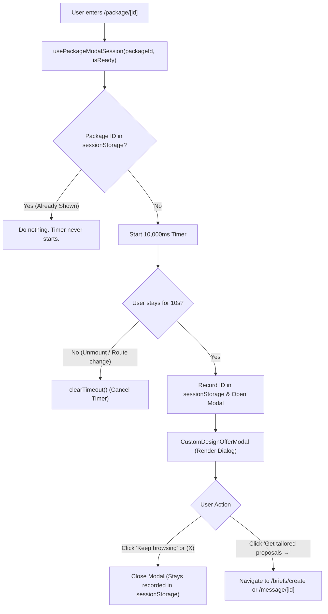

# Implementation Plan: Package Custom Design Proposal Modal

> **Route:** `/package/[id]`  
> **Persistence Engine:** `sessionStorage` (Client-side tab session only)  
> **Execution Status:** PLAN ONLY (Ready for future execution upon explicit instruction).

---

## 1. Executive Summary & Architecture Overview

The **Custom Design Proposal Modal** is an engagement and conversion mechanism designed to capture buyers browsing gig packages who may require a bespoke scope or custom quote. 

To ensure optimal separation of concerns and maintain zero regressions on the existing package detail page:
1. **Session & Timer Logic:** Isolated in a dedicated custom hook: `src/features/package/hooks/usePackageModalSession.ts`.
2. **Modal View Component:** Isolated in a presentation component: `src/features/package/components/CustomDesignOfferModal.tsx`.
3. **Host Integration:** Mounted cleanly at the root of `src/app/(marketing)/package/[id]/page.tsx`.



---

## 2. Session Tracking Protocol (`sessionStorage`)

### 2.1 Storage Key & Data Format
* **Storage Key:** `workvence:custom-design-modal:shown`
* **Data Type:** JSON stringified Array of string identifiers (`string[]`).
* **Example Value in `sessionStorage`:**
  ```json
  ["ui-conversion-landing-page-muc85w30", "65f8c4e0192a5b001a7e4321"]
  ```

### 2.2 Operational Rules
1. **Check Before Start:** Before arming the 10-second timer, read `sessionStorage`. If the current package `_id` or `slug` exists in the array, the hook terminates early and does not initialize a timer.
2. **Record on Show:** When the 10-second timer expires and the modal opens (`setIsOpen(true)`), the hook immediately appends the package `_id` (and `slug` if present) to the array and writes it back to `sessionStorage`.
3. **Dismissal Persistence:** Closing the modal or clicking "Keep browsing" simply sets `isOpen = false`. The package remains in `sessionStorage`, ensuring it will **never re-open for that package in the same browser tab session**.
4. **Session Reset:** Because `sessionStorage` is automatically wiped by the browser when the tab is closed, new browser sessions naturally allow the modal to display again.

### 2.3 SSR-Safe Storage Utility
```ts
const STORAGE_KEY = 'workvence:custom-design-modal:shown';

function getShownPackageIds(): Set<string> {
  if (typeof window === 'undefined') return new Set();
  try {
    const raw = sessionStorage.getItem(STORAGE_KEY);
    if (!raw) return new Set();
    const parsed = JSON.parse(raw);
    return new Set(Array.isArray(parsed) ? parsed : []);
  } catch (err) {
    console.warn('[usePackageModalSession] Error reading sessionStorage:', err);
    return new Set();
  }
}

function markPackageAsShown(packageId: string): void {
  if (typeof window === 'undefined' || !packageId) return;
  try {
    const current = getShownPackageIds();
    current.add(String(packageId).trim());
    sessionStorage.setItem(STORAGE_KEY, JSON.stringify(Array.from(current)));
  } catch (err) {
    console.warn('[usePackageModalSession] Error writing sessionStorage:', err);
  }
}
```

---

## 3. Timer & Navigation Lifecycle State Machine

### 3.1 Timing Parameters
* **Delay Duration:** `10,000ms` (10.0 seconds).
* **Activation Trigger:** Triggers when `isReady === true` (i.e., `!isLoading && Boolean(normalizedData?.id)`).

### 3.2 Lifecycle Hooks & Strict Mode Safety
```ts
export function usePackageModalSession(packageId?: string, isReady: boolean = false) {
  const [isOpen, setIsOpen] = useState(false);

  useEffect(() => {
    if (!isReady || !packageId) return;

    // 1. If already shown in this tab session, do not start timer
    const shownSet = getShownPackageIds();
    if (shownSet.has(packageId)) return;

    // 2. Start 10-second timer
    const timer = setTimeout(() => {
      // Re-verify session storage before popping up
      const latestSet = getShownPackageIds();
      if (!latestSet.has(packageId)) {
        markPackageAsShown(packageId);
        setIsOpen(true);
      }
    }, 10000);

    // 3. Clean up on unmount or when packageId changes
    return () => {
      clearTimeout(timer);
    };
  }, [packageId, isReady]);

  const closeModal = useCallback(() => {
    setIsOpen(false);
  }, []);

  return { isOpen, closeModal };
}
```

---

## 4. Modal Component Specification & UI Contract

### 4.1 Component Props Interface
```ts
export interface CustomDesignOfferModalProps {
  isOpen: boolean;
  onClose: () => void;
  seller?: {
    name?: string;
    username?: string;
    image?: string;
    isOnline?: boolean;
  };
  packageTitle?: string;
  categoryName?: string;
  categorySlug?: string;
  onCtaClick?: () => void;
}
```

### 4.2 Pixel-Perfect UI Blueprint (Matching Supplied Screenshot)

```
┌────────────────────────────────────────────────────────┐
│ ┌────────────────────────────────────────────────────┐ │
│ │  [ Pink / Lime Creative Graphic Banner ]       (X) │ │  <- h-44 sm:h-52 w-full object-cover
│ └────────────────────────────────────────────────────┘ │
│                     ┌───────────┐                      │
│                     │  Avatar   │🟢                    │  <- -mt-10 w-20 h-20 rounded-full border-4 border-white
│                     └───────────┘                      │
│                                                        │
│              Have a custom design in mind?             │  <- text-xs sm:text-sm font-semibold text-slate-500
│            Bring your design idea to life              │  <- text-2xl sm:text-3xl font-extrabold text-[#0f172a]
│                                                        │
│     Share your style, format, and deadline once.       │  <- text-sm text-slate-600 leading-relaxed max-w-sm
│   Compare tailored proposals from design professionals │
│                                                        │
│   Free to post. Your draft stays private until you     │  <- text-xs text-slate-400
│                     publish it.                        │
│                                                        │
│           ┌────────────────────────────┐               │
│           │  Get tailored proposals →  │               │  <- bg-[#1e293b] hover:bg-[#0f172a] text-white font-bold
│           └────────────────────────────┘               │
│                                                        │
│                   Keep browsing                        │  <- text-sm font-semibold text-slate-500 hover:text-slate-800
└────────────────────────────────────────────────────────┘
```

---

## 5. Accessibility & Interaction Requirements

1. **ARIA Attributes:**
   * Dialog Container: `role="dialog"`, `aria-modal="true"`, `aria-labelledby="modal-custom-title"`, `aria-describedby="modal-custom-desc"`.
2. **Keyboard Navigation:**
   * `Escape` Key: Closes modal and returns focus to main content.
   * `Tab` Trapping: Focus remains trapped inside modal dialog while open.
3. **Body Scroll Lock:**
   * When modal opens: `document.body.style.overflow = 'hidden'`.
   * When modal closes: `document.body.style.overflow = 'unset'`.
4. **Focus Restoration:**
   * Save previously focused element before modal open; restore focus upon close.

---

## 6. Primary CTA & Navigation Destination Recommendation

### Recommendation: Dynamic Brief & Contact Destination
* **Primary Target:** Route to `/briefs/create?category=${categorySlug}&title=Custom+Request`
  * Matches the headline text: *"Compare tailored proposals from design professionals. Free to post. Your draft stays private until you publish it."*
* **Secondary Direct Contact Trigger:** If the buyer is already authenticated and prefers direct messaging, provide a secondary option to contact the current seller directly via `handleContact`.

---

## 7. Edge Cases & Resilience Matrix

| Edge Case | Handling Strategy |
| :--- | :--- |
| **User navigates away in 5s** | `clearTimeout(timer)` runs in `useEffect` cleanup; timer is cancelled, no modal opens. |
| **User visits Package A -> B -> A** | Package A modal shown once -> B modal shows after 10s -> returning to A sees ID in `sessionStorage`, timer does not start. |
| **`sessionStorage` disabled / private mode** | Wrapped in `try/catch`; falls back to component in-memory state without crashing. |
| **React 19 Strict Mode double mount** | Mount 1 starts timer -> unmount clears timer -> Mount 2 starts single active timer. |
| **Package data 404 / error** | `isReady` flag is `false`; timer never starts for broken packages. |
| **Rapid slug switching** | `packageId` dependency in `useEffect` clears the previous timer and starts a fresh timer for the new package. |

---

## 8. Exact File Change Blueprints

### File 1: Create `src/features/package/hooks/usePackageModalSession.ts`
```ts
"use client";

import { useState, useEffect, useCallback } from "react";

const STORAGE_KEY = "workvence:custom-design-modal:shown";

function getShownIds(): Set<string> {
  if (typeof window === "undefined") return new Set();
  try {
    const raw = sessionStorage.getItem(STORAGE_KEY);
    if (!raw) return new Set();
    const parsed = JSON.parse(raw);
    return new Set(Array.isArray(parsed) ? parsed : []);
  } catch {
    return new Set();
  }
}

function recordId(id: string) {
  if (typeof window === "undefined" || !id) return;
  try {
    const current = getShownIds();
    current.add(String(id).trim());
    sessionStorage.setItem(STORAGE_KEY, JSON.stringify(Array.from(current)));
  } catch {}
}

export function usePackageModalSession(packageId?: string, isReady: boolean = false) {
  const [isOpen, setIsOpen] = useState(false);

  useEffect(() => {
    if (!isReady || !packageId) return;

    const shown = getShownIds();
    if (shown.has(String(packageId).trim())) return;

    const timer = setTimeout(() => {
      const latest = getShownIds();
      if (!latest.has(String(packageId).trim())) {
        recordId(packageId);
        setIsOpen(true);
      }
    }, 10000);

    return () => clearTimeout(timer);
  }, [packageId, isReady]);

  const closeModal = useCallback(() => setIsOpen(false), []);

  return { isOpen, closeModal };
}
```

### File 2: Create `src/features/package/components/CustomDesignOfferModal.tsx`
```tsx
"use client";

import React, { useEffect, useRef } from "react";
import { X, ArrowRight } from "lucide-react";
import { Button } from "@/components/ui";

export interface CustomDesignOfferModalProps {
  isOpen: boolean;
  onClose: () => void;
  seller?: {
    name?: string;
    username?: string;
    image?: string;
    isOnline?: boolean;
  };
  categoryName?: string;
  onCtaClick?: () => void;
}

export const CustomDesignOfferModal: React.FC<CustomDesignOfferModalProps> = ({
  isOpen,
  onClose,
  seller,
  categoryName = "Design",
  onCtaClick,
}) => {
  const modalRef = useRef<HTMLDivElement>(null);

  useEffect(() => {
    if (!isOpen) return;
    const handleKeyDown = (e: KeyboardEvent) => {
      if (e.key === "Escape") onClose();
    };
    document.addEventListener("keydown", handleKeyDown);
    document.body.style.overflow = "hidden";
    return () => {
      document.removeEventListener("keydown", handleKeyDown);
      document.body.style.overflow = "unset";
    };
  }, [isOpen, onClose]);

  if (!isOpen) return null;

  return (
    <div
      className="fixed inset-0 z-[1000] flex items-center justify-center p-4 bg-slate-900/60 backdrop-blur-xs animate-fadeIn select-none"
      onClick={onClose}
    >
      <div
        ref={modalRef}
        role="dialog"
        aria-modal="true"
        aria-labelledby="modal-custom-title"
        className="bg-white rounded-[16px] max-w-[480px] w-full overflow-hidden shadow-2xl border border-slate-100 flex flex-col items-center text-center relative transform transition-all duration-300 animate-scaleUp"
        onClick={(e) => e.stopPropagation()}
      >
        {/* Top Split Visual Banner */}
        <div className="relative w-full h-44 sm:h-52 bg-gradient-to-r from-pink-500 via-rose-400 to-lime-200 overflow-hidden">
           {
              (e.currentTarget as HTMLElement).style.display = "none";
            }}
          />
          {/* Close Button */}
          <button
            type="button"
            onClick={onClose}
            className="absolute top-4 right-4 w-9 h-9 rounded-full bg-white/90 hover:bg-white text-slate-700 shadow-md flex items-center justify-center transition"
            aria-label="Close modal"
          >
            <X size={18} strokeWidth={2.5} />
          </button>
        </div>

        {/* Floating Seller Avatar */}
        <div className="relative -mt-10 w-20 h-20 rounded-full border-4 border-white bg-white shadow-md shrink-0">
          
          {seller?.isOnline && (
            <span className="absolute bottom-0 right-0 w-3.5 h-3.5 bg-emerald-500 border-2 border-white rounded-full" />
          )}
        </div>

        {/* Modal Body */}
        <div className="p-6 sm:p-8 pt-4 flex flex-col items-center gap-3">
          <span className="text-xs sm:text-sm font-semibold text-slate-500">
            Have a custom {categoryName.toLowerCase()} in mind?
          </span>

          <h2 id="modal-custom-title" className="text-2xl sm:text-3xl font-extrabold text-[#0f172a] tracking-tight">
            Bring your design idea to life
          </h2>

          <p className="text-sm text-slate-600 leading-relaxed max-w-sm">
            Share your style, format, and deadline once. Compare tailored proposals from design professionals.
          </p>

          <p className="text-xs text-slate-400">
            Free to post. Your draft stays private until you publish it.
          </p>

          {/* Action Buttons */}
          <div className="w-full flex flex-col items-center gap-3 mt-4">
            <Button
              type="button"
              variant="primary"
              size="lg"
              className="w-full bg-[#1e293b] hover:bg-[#0f172a] text-white font-bold py-3.5 rounded-[8px] flex items-center justify-center gap-2 text-sm shadow-md"
              onClick={onCtaClick}
            >
              Get tailored proposals <ArrowRight size={16} />
            </Button>

            <button
              type="button"
              onClick={onClose}
              className="text-sm font-semibold text-slate-500 hover:text-slate-800 transition py-1"
            >
              Keep browsing
            </button>
          </div>
        </div>
      </div>
    </div>
  );
};
```

### File 3: Update `src/app/(marketing)/package/[id]/page.tsx`
* Import `usePackageModalSession` and `CustomDesignOfferModal`.
* Call hook: `const { isOpen: isCustomModalOpen, closeModal: closeCustomModal } = usePackageModalSession(_id, !isLoading && Boolean(normalizedData.id));`
* Mount `<CustomDesignOfferModal isOpen={isCustomModalOpen} onClose={closeCustomModal} seller={normalizedData.seller} categoryName={normalizedData.categoryName} onCtaClick={() => router.push('/briefs/create')} />`.

---

## 9. Step-by-Step Implementation Sequence

1. **Step 1: Banner Graphic Asset**
   - Provide high-resolution composite banner graphic in `/public/media/custom-design-banner.jpg`.
2. **Step 2: Session Hook (`usePackageModalSession.ts`)**
   - Create hook with unit-tested storage handlers and timeout management.
3. **Step 3: Component (`CustomDesignOfferModal.tsx`)**
   - Implement dialog structure, backdrop, responsive layout, and accessibility features.
4. **Step 4: Package Detail Page Integration**
   - Mount hook and component in `src/app/(marketing)/package/[id]/page.tsx`.
5. **Step 5: End-to-End Verification**
   - Run type checks (`tsc --noEmit`) and perform manual session testing.

---

## 10. Comprehensive Testing Checklist

### Session Behavior
- [ ] First visit to Package A: modal appears after 10 seconds.
- [ ] Dismiss Package A modal: it stays closed.
- [ ] Revisit Package A: modal does not appear again.
- [ ] Visit Package B: modal appears after 10 seconds.
- [ ] Revisit Package B: modal does not appear again.
- [ ] Open a new browser tab/session: Package A can show again.
- [ ] Open a new browser tab/session: Package B can show again.

### Timer Behavior
- [ ] Navigate away before 10 seconds: modal never appears.
- [ ] Change package ID: previous timer is cleared immediately.
- [ ] New package gets its own independent timer.
- [ ] Already-seen package does not start a timer.
- [ ] No duplicate modal appears.
- [ ] React Strict Mode does not cause duplicate timers.

### Interaction & Accessibility
- [ ] Close button `(X)` works.
- [ ] `Escape` key works.
- [ ] "Keep browsing" closes modal.
- [ ] Primary CTA navigates to brief creation / contact flow.
- [ ] Focus is trapped inside modal while open.
- [ ] Background scrolling is locked while open.
- [ ] Focus returns to previous element after dismissal.
- [ ] Screen readers identify `role="dialog"` and `aria-labelledby`.

### Responsive Layout
- [ ] 375px mobile (iPhone SE)
- [ ] 390px mobile (iPhone 14)
- [ ] 768px tablet (iPad)
- [ ] 1024px laptop
- [ ] 1440px desktop
- [ ] 1920px wide desktop
